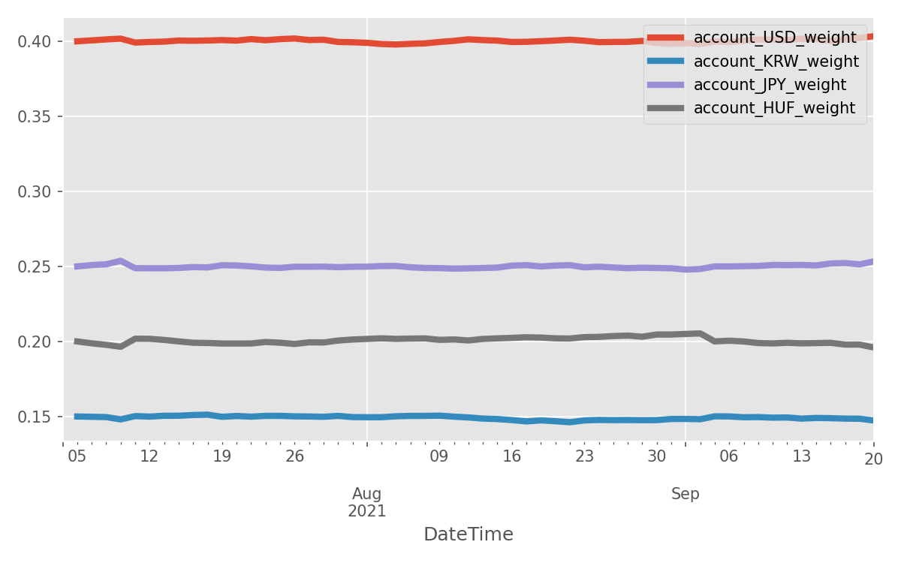

# rhizopus

`rhizopus` is a Python trading simulation framework and a backtesting tool. It
can be used to construct broker simulators for backtesting with historical 
data, as well as for live trading. Its main goal is to provide a simple unified 
interface for both backtesting and live trading.

## Features

* Support for multiple currencies.
* Bid-ask spreads.
* Easy integration of any type to transaction costs, e.g. fixed transaction fees.

## Look and feel

The following code runs a constant-mix strategy given by the weights in the `target_alloc` dict. 
See `example.py` for details.

    target_alloc = {
        'USD': 0.4,
        'KRW': 0.15,
        'JPY': 0.25,
        'HUF': 0.2,
    }
    assert abs(sum(target_alloc.values()) - 1.0) < 1e-8

    series_store = get_series_store('EUR')
    filters = [
        TransactionCostFilter('EUR', 5.0, "transaction_cost", []),  # 5 EUR per transaction
    ]
    broker_simulator = BrokerSimulator(
        series_store,
        filters,
        default_numeraire='EUR',
    )
    accounts = {num: (0.0, num) for num in series_store.vertices()}
    accounts['EUR'] = (1.0e6, 'EUR')  # start capital
    initial_orders = [CreateAccountOrder(num, amount) for num, amount in accounts.items()]
    broker = Broker(broker_simulator, initial_orders=initial_orders)

    strategy = ConstantMixStrategy(broker, target_alloc)
    # On the first day we just observe the market prices and do nothing. Trading starts on the next day.
    trading_start_time = series_store.get_min_time() + datetime.timedelta(days=1)
    strategy.run(trading_start_time, max_iterations=100)

    df = get_observer_df(strategy.observer)
    plot_normalized_asset_performance(df, target_alloc.keys(), 'EUR')
    plot_account_weights(df, target_alloc.keys())

### Portfolio and asset performance

### Carpet chart

## Installation

`rhizopus` does not depend on any other python package outside the Python standard library.

### GitHub

Clone this repository and call `pip install` from the main directory:

    git clone https://github.com/jwergieluk/rhizopus.git
    cd rhizopus
    pip install -e .

### Conda

Coming soon.

## License

`rhizopus` is released under GNU GENERAL PUBLIC LICENSE Version 3. See LICENSE file for details.

Copyright (c) 2016--2021 Julian Wergieluk
